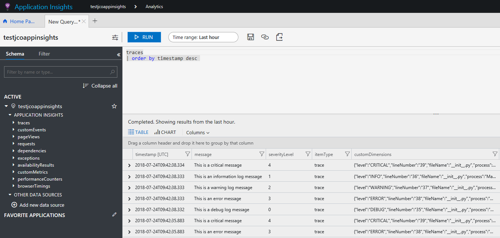
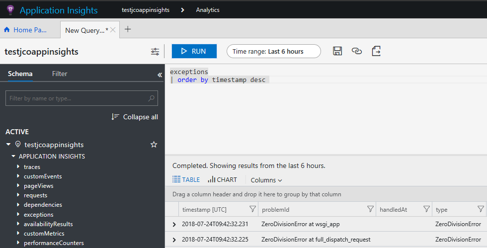
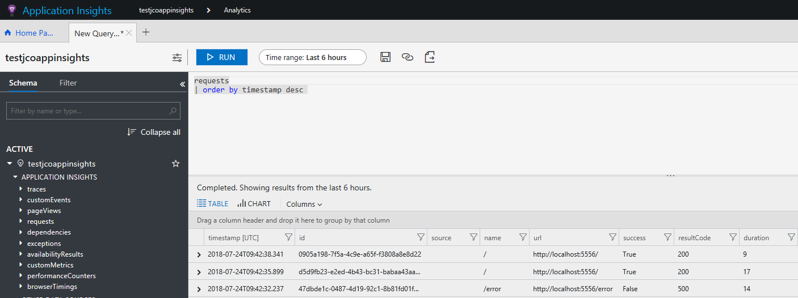

# python-flask-appinsights

This is a simple Python Flask web app with Azure Application Insights monitoring integration

## Run the sample

### Create an Azure Application Insights resource

All you need before running this Python Flask web application is to create an Azure Application Insights resource and get the instrumentation key. In order to do that, you can follow [this documentation](https://docs.microsoft.com/en-us/azure/application-insights/app-insights-create-new-resource).

### Define an environment variable named INSTRUMENTATION_KEY

When the application starts the Application Insights instrumentation key is retrieved from an environment variable named `INSTRUMENTATION_KEY`.

If you are using PowerShell:

```Powershell
$env:INSTRUMENTATION_KEY='YOUR_APPINSIGHT_INSTRUMENTATION_KEY'
```

If you are using Bash:

```bash
export INSTRUMENTATION_KEY='YOUR_APPINSIGHT_INSTRUMENTATION_KEY'
```

### Install pip packages

If you are using PowerShell:

```Powershell
pip install -r .\requirements.txt
```

If you are using Bash:

```bash
pip install -r ./requirements.txt
```

### Run the application

If you are using PowerShell:

```Powershell
python.exe .\runserver.py
```

If you are using Bash:

```bash
python ./runserver.py
```

### Generate data for Application Insights

Browse `/` on the web application to generate traces with different log levels:

```python
@app.route("/")
def hello():
    app.logger.debug('This is a debug log message')
    app.logger.info('This is an information log message')
    app.logger.warn('This is a warning log message')
    app.logger.error('This is an error message')
    app.logger.critical('This is a critical message')
    return "Hello World!"
```

Browse `/error` to raise an unhandled exception:

```python
@app.route("/error")
def hello_error():
  a = 42
  b = 0
  c = a/b
  return "a / b = {c}".format(c=c)
```

### Browse Application Insights Data

After a while, you should be able to see generated data in the Analytics tools provided by Azure Application Insights (click on the **Analytics** button in the Azure portal):

*traces:*



*exceptions:*



*requests:*



## How to

### Set up Application Insights for Flask web app

First, you need to add a pip requirement for `applicationinsights`

Then, you can initialize Application Insights like this:

```python
from applicationinsights.flask.ext import AppInsights

# create Flask app
app = Flask(__name__)
app.config['APPINSIGHTS_INSTRUMENTATIONKEY'] = 'YOUR_INSTRUMENTATION_KEY'
appinsights = AppInsights(app)

# force flushing application insights handler after each request
@app.after_request
def after_request(response):
    appinsights.flush()
    return response
```

### Log traces to Application Insights

After Application Insights has been initialized on the Flask web app, you can just get a reference to the logger using `app.logger` and then use any logging functions available on it:

```python
@app.route("/")
def hello():
    app.logger.debug('This is a debug log message')
    app.logger.info('This is an information log message')
    app.logger.warn('This is a warning log message')
    app.logger.error('This is an error message')
    app.logger.critical('This is a critical message')
    return "Hello World!"
```

### Log exceptions to Application Insights

By default, Application Insights will log every unhandled exception in your Flask application. If you log your exception to personalize http responses, you can use the `app.logger.exception(e)` function to report exception to the Application Insights handler.

### Continue to log information on stdout

By default, when registering Application Insights with your Flask application, you will not receive any trace on stdout. If you want them to be back, you need to add a `StreamHandler` to the Flask application logger.

```python
# import
from logging import StreamHandler

# keep stdout/stderr logging using StreamHandler
streamHandler = StreamHandler()
app.logger.addHandler(streamHandler)
```

### Personalize the log level and log format

By default, Flask application logs only message starting *warning* level using a default format. If you want, you can change this behavior:

```python
# after Application Insights configuration

# keep stdout/stderr logging using StreamHandler
streamHandler = StreamHandler()
app.logger.addHandler(streamHandler)

# define log level to DEBUG
app.logger.setLevel(logging.DEBUG)

# apply same formatter on all log handlers
for logHandler in app.logger.handlers:
  logHandler.setFormatter(logging.Formatter('[FLASK-SAMPLE][%(levelname)s]%(message)s'))
```